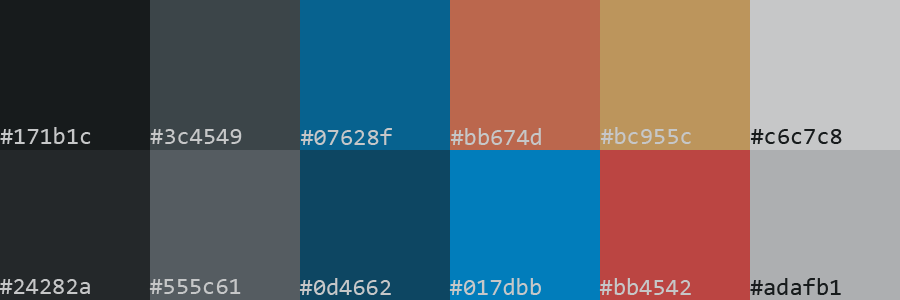

# dotfiles
My Linux build's configuration files.  My goals for this system are:
- looks good
- lightweight
- efficient to use
- secure
- high level of control over filesystem (like on OSX, I lose track of files all the time& it's impossible to fully uninstall things)

## What I am using:
- OS: [EndeavourOS](https://endeavouros.com/) (built on top of Arch).
- Window Manager: [Qtile](https://qtile.org/) This takes care of my bar as well, so it is my entire desktop environment.
- Package Managers (2): [pacman](https://archlinux.org/pacman/) and [yay](https://github.com/Jguer/yay) for interfacing with [AUR](https://aur.archlinux.org/).
- Terminal Emulator: [xfce4-terminal]
- Shell: [bash](https://en.wikipedia.org/wiki/Bash_(Unix_shell))
- Editor: [VScode](https://code.visualstudio.com/)
- Web Browser: [Firefox](https://www.mozilla.org/en-US/firefox/new/)
- File Browser: [Thunar](https://wiki.archlinux.org/title/thunar)
- Audio: [Spotify (spotify-launcher)](https://archlinux.org/packages/extra/x86_64/spotify-launcher/) Not really maintained, but that might be a good thing -- you aren't subject to the relentless A/B testing they're always doing.

## Installing:
```shell
... to be completed at a later date ...
```

## Aesthetics:
Aesthetics are very important to me.
### Colors:
Completely custom

### Font:
[Input](https://input.djr.com/license/) by David Jonathan Ross
