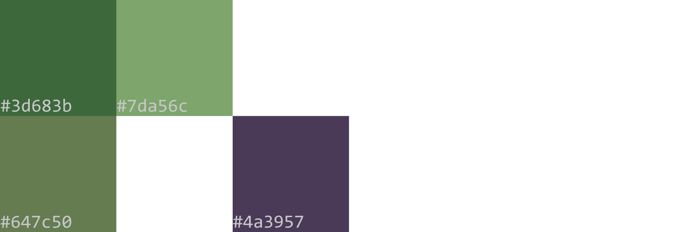

# @johnmays dotfiles
My Linux build's configuration files.  

## Quick Note:
This is still a work in progress.  Many programs and GUIs are unfinished.

## Goals:
My goals for this system are to modify it so that it:
- looks good, but simple
- is lightweight
- is efficient to use
- is secure
- has a high level of control over filesystem (like on OSX, I lose track of files all the time & it's impossible to fully uninstall things)

## What I am using:
### Software:
#### Core:
- OS: [EndeavourOS x86_64](https://endeavouros.com/) (based on Arch)
  - Release: Cassini Nova
  - Kernel: Linux 6.5.9-arch2-1
- Init system: [systemd](https://systemd.io/)
- Window System: [X11](https://www.x.org/wiki/)
- Window Manager: [Qtile](https://qtile.org/) This takes care of my bar as well, so it is my entire desktop environment.
- Package Managers (2):
  - [pacman](https://archlinux.org/pacman/)
  - [yay](https://github.com/Jguer/yay) for interfacing with [AUR](https://aur.archlinux.org/).
- Terminal Emulator: [alacritty](https://github.com/alacritty/alacritty)
- Shell: [bash](https://en.wikipedia.org/wiki/Bash_(Unix_shell))
- Editor: [VSCode (OSS Version)](https://github.com/microsoft/vscode)
- Web Browser: [Firefox](https://www.mozilla.org/en-US/firefox/new/)
#### Other Programs:
- File Browser: [Thunar](https://wiki.archlinux.org/title/thunar)
- Music Streaming: [Spotify (spotify-launcher)](https://archlinux.org/packages/extra/x86_64/spotify-launcher/) Not really maintained, but that might be a good thing, because you aren't subject to the relentless A/B testing they're always doing.
- Screenshot Utility: [Flameshot](https://flameshot.org/)
- Launcher: [rofi](https://github.com/davatorium/rofi)
- Image viewer: [nsxiv](https://codeberg.org/nsxiv/nsxiv)
- Bluetooth Utility: [bluez](https://archlinux.org/packages/extra/x86_64/bluez/)
- Image viewer: [nsxiv](https://codeberg.org/nsxiv/nsxiv)
- Video viewer: [mpv](https://mpv.io/)
- Video utility: [ffmpeg](https://www.ffmpeg.org/)
### PC:
Lenovo Thinkpad T480 (2018) with
- Intel Core i7-8550U CPU @ 1.80GHz (4 cores, 8 threads)
- 16 GB Memory
- No card, just onboard Intel UHD Graphics 620
- 250 GB SSD (OS living on 110 GB partition)

## Installing & Replicating:
__Note:__ This repo is constructed with a bare git repository. The repo itself is stored in a folder in my root directory I decided to name `.cconfig.git`.  All of the heads and everything are stored in there, like a normal git repository's `.git`.  By default, a bare repo will not track any inodes in adjacent or child directories.  Only if I explicitly ask this repo to track a file in its scope, will it then do so.  This is how I selectively keep track of files scattered all over my system, and may also explain why the directory structure in this repo looks so weird.

The essential takeaway is that if you'd like to replicate some of the stuff in my dotfiles, you should be attempting to place these files and directories in approximately the same places in _your_ filesystem.

For example, if you wanted your rofi to act like mine, you should try to replace the files in `home/you/.config/rofi/` (__always__ have a way to switch back from a terminal) with the files in `<this-repo>/.config/rofi/`

I wish there was a neat way to install with a few commands, but I don't have the time to make that happen smoothly.  So, here are a few things you could do to start:

1. Install EndeavourOS Qtile community edition
2. Use pacman, yay, and grep to install all of the programs in my list [here](./Documents/config_notes/)
3. Copy files from [.config](./.config/) to their respective directories on your system.  Be especially careful when configuring qtile because it has the ability to make your system inoperable if it encounters an error.

## Aesthetics:
I've tried to transform at least the colors and font of every program I could
### Colors:
These are completely custom
#### Core palette:

#### Extra colors for editor:

### Font:
[Input Mono](https://input.djr.com/license/) by David Jonathan Ross

